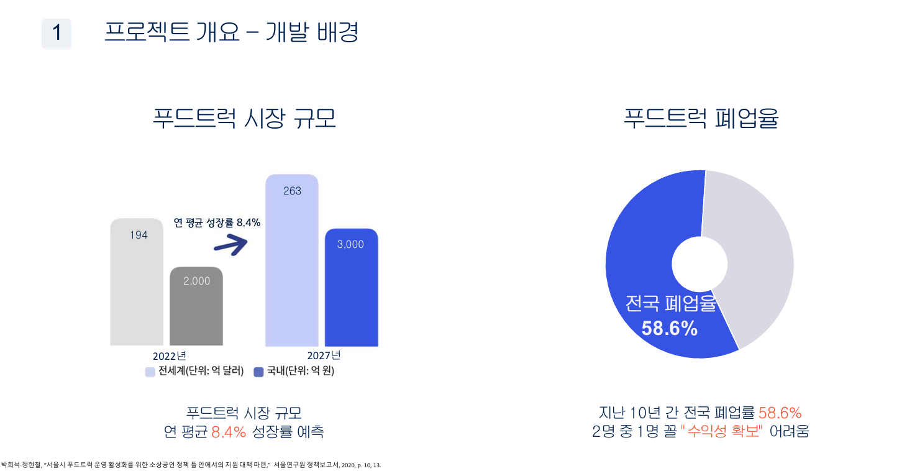
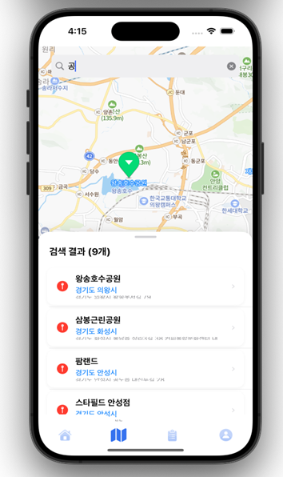
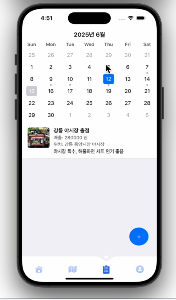
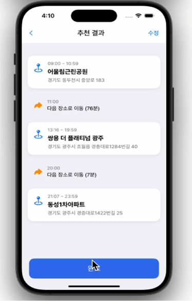

# 🚀 사장님 여기요 (Boss Over Here)

푸드트럭 사장님들의 **수익 최적화**를 돕는 맞춤형 서비스  
실시간 인구 유동 데이터와 AI 경로 추천, 매출·지출 기록 관리 기능 제공

---

## 📖 목차

1. [프로젝트 개요](#프로젝트-개요)
2. [배경 및 동기](#배경-및-동기)
3. [ERD](#erd)
4. [API 명세](#api-명세)
5. [주요 기능](#주요-기능)

---

## 프로젝트 개요

- **서비스명**: 사장님 여기요
- **목표**:
  - 푸드트럭 허가 구역 정보 제공
  - 매출·지출 기록 관리
  - AI 기반 최적 영업 경로 추천

---

## 배경 및 동기

  
푸드트럭은 진입 장벽이 낮고 기동성이 뛰어나 **젊은 창업자**에게 인기지만,  
서울연구원 정책보고서에 따르면
> 지난 10년간 푸드트럭 폐업율 **58.6%**  
> – 두 명 중 한 명꼴로 수익성 확보에 어려움을 겪음

이에 **사장님 여기요**는
- 허가 구역 정보 제공
- 매출·지출 기록 관리
- AI 기반 경로 추천

을 통해 사장님들의 **편의**와 **수익 최적화**를 돕고자 합니다.

---

## ERD

시각적으로 확인하실 수 있는 ERD는 아래 Lucidchart 링크를 참고하세요.  
[🔗 ERD 다이어그램 (Lucidchart)](https://lucid.app/lucidchart/4d17a75e-1707-4fe9-b255-7f4e340d47c6/edit?invitationId=inv_3d5c338a-3331-4463-bc16-38a7547a5e9d)

---

## API 명세

모든 엔드포인트 및 요청·응답 스펙은 아래 노션 링크에서 확인하세요.  
👉 [API Specification](https://www.notion.so/API-1f183ae2922c80518d1df74e67c86379)

---

## 주요 기능

### 1️⃣ 허가 구역 상세 정보 제공

- 경기도 59개 허가 구역의 **이름**, **주소**, **영업 가능 시간**을  
  지도에서 터치 한 번으로 확인

---

### 2️⃣ 개인 기록 관리

- **매출·지출** 정보를 입력하여 일별·장소별 기록
- 다양한 상권 매출을 **필터링·비교** 가능

---

### 3️⃣ AI 기반 최적 영업 경로 추천

- 판매 음식 종류, 시작 장소·시간을 입력
- **실시간 유동인구** 데이터를 분석하여
- 최적의 **영업 경로** 계산 및 안내